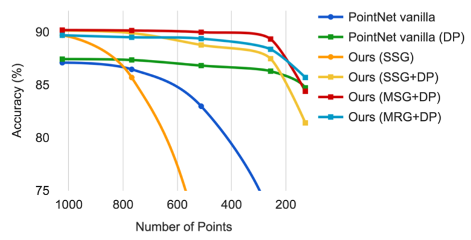
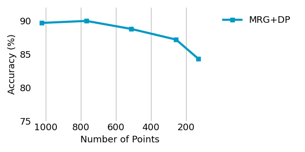
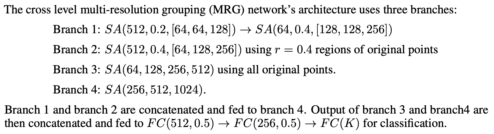

Pointnet++/Multi-resolution grouping for classifiaction 
============================


Acknowledgement
---------------

* The official [code](https://github.com/charlesq34/pointnet2) in tensorflow and [paper](https://arxiv.org/abs/1706.02413) 
* The initial [code](https://github.com/erikwijmans/Pointnet2_PyTorch) of Pytorch implementation of Pointnet++
  -> Two repos doesn't provide MRG for classification  

Intrduction 
-----------
In pointnet++ paper, there are three classification methods(SSG, MSG, MRG). Above two repos provide SSG and MSG methods. 

* This repo only provide ``MRG for classifation`` in Pytorch. 

* Other parts uses [erikwijmans/Pointnet2_PyTorch](https://github.com/erikwijmans/Pointnet2_PyTorch). 
  
```
├── images
├── pointnet2
│   ├── config      
│   │   ├── model
│   │   │   └── mrg.yaml
│   │   └── task_model
│   │       └── cls-mrg.yaml
│   └── models
│       ├── __init__.py
│       └── pointnet2_mrg_cls.py
└── graph_visualization.py

```


Library Dependencies 
---------------------
To use ``RTX 3090``, follow under versions. 
* ``Python`` : ``3.7.0``
* ``Pytorch`` : ``1.7.1+cu110``
* ``Cuda toolkit`` : ``11.2``
* Other packages dependencies follow ``erikwijmans/Pointnet2_PyTorch`` [setup](https://github.com/erikwijmans/Pointnet2_PyTorch)

Robustness Test 
---------------

<figure>
  
</figure>

First figure is robustness test result in ``Pointnet++`` paper. Three methods (Sigle-scale grouping (SSG), Multi-scale grouping(MSG), Multi-resolution grouping(MRG)) tested with random point dropout(DP). The official code uses dropout ratio ``[0, 0.875]``. 
``MRG+DP`` model shows the lesast reduction of perfermances from 1024 to 128 test points. 

Second figure is robustness test result of ``MRG+DP`` which I implemented. I also used dropout ratio ``[0, 0.875]``. 

|Number of Points|1024|768|512|256|128|
|------|---|---|---|---|---|---|
|MRG+DP|89.7%|90.0%|88.8%|85.8%|83.2%|


MRG architecture 
---------------
<figure>
    
</figure>
This MRG model follow architecture in pointnet++ paper(page 11)


Citation
-------- 
```
@article{pytorchpointnet++,
      Author = {Erik Wijmans},
      Title = {Pointnet++ Pytorch},
      Journal = {https://github.com/erikwijmans/Pointnet2_PyTorch},
      Year = {2018}
}

@inproceedings{qi2017pointnet++,
    title={Pointnet++: Deep hierarchical feature learning on point sets in a metric space},
    author={Qi, Charles Ruizhongtai and Yi, Li and Su, Hao and Guibas, Leonidas J},
    booktitle={Advances in Neural Information Processing Systems},
    pages={5099--5108},
    year={2017}
}

```